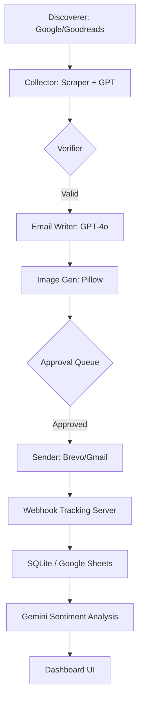

# 📚 Triumphant Author Outreach Agent 🚀

[](https://www.python.org/downloads/)
[](https://openai.com/)
[](https://opensource.org/licenses/MIT)
[](https://github.com/features/actions)

> **Enterprise-grade, multi-channel AI agent designed to discover authors, verify contact data, and manage intelligent, personalized outreach at scale.**

---

## 📽️ Dashboard Preview

*(Note: Replace with a real screenshot of your http://localhost:8080 once running!)*

---

## 🚀 Key Features

### 🧠 **1. AI Intelligence Core**
- **Personalized invitations:** Uses **GPT-4o** to write unique, hyper-contextual emails based on an author's real books, bio, and genre.
- **Sentiment Analysis:** Integrated with **Gemini Pro** to classify incoming replies (Interested, Not Interested, Asking Price, etc.) automatically.
- **Smart Follow-ups:** Maintains conversation state and generates context-aware follow-up emails based on full thread history.

### 📊 **2. Enterprise Monitoring (Live Dashboard)**
- **Real-time Metrics:** Track open rates, reply rates, and weekly growth via a sleek, modern Flask-powered UI.
- **A/B Testing Engine:** Automatically tests different email tones (Variant A vs B) and displays conversion stats to optimize outreach strategy.
- **Approval Queue:** Optional "Human-in-the-Loop" mode to vet AI drafts before they are sent.

### 🛡️ **3. Deliverability & Safety**
- **3-Layer Verification:** Syntax check, MX record lookup, and SMTP handshake probing to maintain a near-zero bounce rate.
- **Warmup Mode:** Dynamically scales daily email volume to protect domain reputation.
- **Circuit Breaker:** Automatically pauses outreach if the bounce rate exceeds a defined threshold (e.g., 2%).
- **Smart Scheduling:** Enforces UTC send windows to ensure emails land in inboxes during local business hours.

### 🔗 **4. Custom Tracking & CRM**
- **First-Party Tracking:** Built-in tracking pixel and click-redirect server (no external services required).
- **Lead Scoring:** Authors earn points for opens (+1) and clicks (+5), highlighting "HOT" leads on the dashboard.
- **Multi-Channel Sync:** Seamlessly integrates with Google Sheets, Google Docs, and a local SQLite master database.

---

## 🛠️ Tech Stack

- **Language:** Python 3.10+
- **AI/LLM:** Groq (LLaMA 3.3), OpenAI (GPT-4o), Google Gemini Pro
- **Backend:** Flask (Webhook Server + Dashboard)
- **Database:** SQLite (Relational State Management)
- **Integrations:** SendGrid/Brevo SMTP, Google Sheets API, Google Docs API
- **Image Gen:** Pillow (Local high-quality visual personalization)

---

## 🏗️ Architecture



---

## ⚙️ Setup & Installation

1. **Clone the repository:**
   ```bash
   git clone https://github.com/yourusername/rejoicebookclub_agent.git
   cd rejoicebookclub_agent
   ```

2. **Install dependencies:**
   ```bash
   pip install -r requirements.txt
   ```

3. **Configure Environment:**
   - Copy `.env.example` to `.env`.
   - Fill in your API keys (OpenAI, Groq, Gemini, Google Service Account).

4. **Launch:**
   - **Run Outreach:** `python main.py --run-now`
   - **Start Dashboard:** `python main.py --dashboard` (Access at `http://localhost:8080`)

---

## 📄 License

This project is licensed under the **MIT License** - see the [LICENSE](LICENSE) file for details.

---

## 👨‍💻 Author
**[Olamilekan Amujosafe (olamilekanAMF)]**
*Full Stack & AI Automation Engineer*
[Instagram](https://instagram.com/lekjason22) | [Portfolio](https://olamilekanamf-portfolio.netlify.app/)
